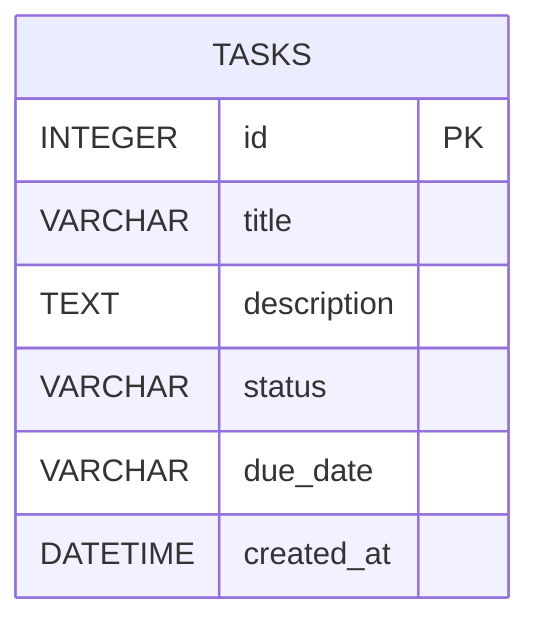

# Entity Relationship Diagram

```mermaid
erDiagram
    TASKS {
        INTEGER id PK
        VARCHAR title
        TEXT description
        VARCHAR status
        VARCHAR due_date
        DATETIME created_at
    }
```

This project uses one main entity, `tasks`, because the assessment requires records that can be listed, added, updated, and deleted.
